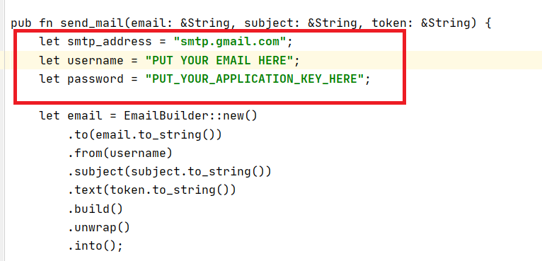

# Report

The project was created from a template proposed by the teacher. The functions to communicate from the server to the client were not created by me.

## Instruction

### Main goal

The goal of this lab is to implement a two-factor authentication mechanism (2FA). We will
use the following two factors:

- A password
- A Yubikey (https://www.yubico.com/)

You have to implement the following features:

1. A registration process asking for a password, an email address, and a Yubikey. The
email is going to be used as a username and to reset the password.
2. A login process asking for an email address, a password, and a Yubikey (when 2FA is
enabled).
3. A password reset process sending a token by email.
4. A possibility to disable the 2FA for a user.

### Authentication

- Regarding password authentication, we will use strong authentication using a
  challenge-response protocol. This means that we do not send the password to authen-
  ticate. Instead, we receive a challenge, which is a random value (e.g. 128 bits) and we
  have to compute a response using a MAC algorithm and a key. In this lab, we are
  going to use the HMAC-SHA256 algorithm. The key for the MAC will be derived from
  the password using a hash function of your choice.1
- For the second factor, using the Yubikey, we will use the PIV authentication (https://
  developers.yubico.com/PIV/, https://docs.rs/yubikey/0.5.0/yubikey/piv/index.
  html). Regarding the signature algorithm, we will use the ECDSA signature algorithm
  over the elliptic curve P-256. You do not need to understand the advantages and
  problems of these various algorithms in this class.

## Interesting file

The authentication mechanism is implemented here: [https://github.com/rya-sge/2FA-yubikey/blob/main/server/src/authentication.rs](https://github.com/rya-sge/2FA-yubikey/blob/main/server/src/authentication.rs)

## Configuration

On the server side, change the configuration for sending email in mailer.rs

## Question

> What are the advantages of a challenge-response authentication compared to a weak
> authentication protocol?

With a challenge-response authentication, the password is sent only once  at registration. This decreases the risk that a man in the middle intercepts the password.

> In your application, when do you require the user to input its Yubikey? Justify.

When registering to store the user's public key on the server side

During the authentification, if the 2FA is activate.

If 2FA authentication is enabled, we can require the yubikey to reset the password [not implementend for this homework]. Thus, if the user's email is hacked, an attacker can't reset the password.

> What can you do to handle Yubilkey losses?

As for the password reset, we can sent a token by email. The user can then enter this token to configure a new yubi key. In addition to the token, you can also require the password.

Another possibility is to ask the user to authenticate several keys, but the user only needs one key to authenticate. Thus, if the user loses his key, he can authenticate with another key he owns.

Reference : [https://support.yubico.com/hc/en-us/articles/360013647620-Losing-Your-YubiKey](https://support.yubico.com/hc/en-us/articles/360013647620-Losing-Your-YubiKey)

> An attacker recovered the challenge and the associated response (in the password au-
> thentication). How does this allow an attacker to perform a bruteforce attack? What
> did you implement to make this attack hard?

It can compute the tag with hmac on the  challenge and compares it with the associated response.

It must, however, derive a key with argon2 from its password list or generate a key list.

This attack can be done locally on his computer.

The best way is to implement a password policy to make this attack more difficult.

No measures have been implemented in the lab to make the brute-force attack more difficult (Apart from using argon2 to derive the key).

> For sending the email, what are the advantages of using an application password?

The app password is easily revocable. In addition, in the context of a google account, a user password allows access to many more resource than the application password gives.

It can also be used to reduce access. For example, the one I was using was limited to a Windows device.

> In the Yubikey, what is the purpose of the management key, the pin and the puk?

- PIN

A PIN permits to perform actions such as creating a digital signature. It is a code that the user must enter.

The PIN is blocked if the user enters three incorrect PINS consecutively.

- Management key

The management key is required for PIV operations. This is  a 24 bytes 2DES key. Nevertheless, it is possible to set a default key or "or you can choose to not set a Management Key, instead using the PIN for these operations."

- PUK

For the puk, it is clearly documented in the documentation : "The PUK can be used to reset the PIN if it is ever lost or becomes blocked after the maximum number of incorrect attempts. "

Unlike the PIN, if the PUK is blocked, then a complete reset is required

Reference : [https://developers.yubico.com/yubikey-piv-manager/PIN_and_Management_Key.html](https://developers.yubico.com/yubikey-piv-manager/PIN_and_Management_Key.html)